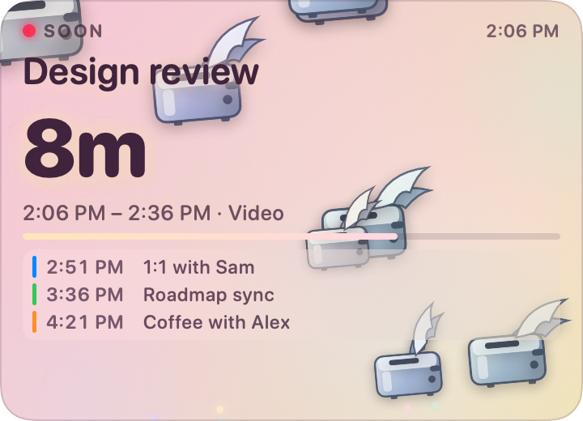

# Mind

A small, calm macOS app that sits in the corner of your screen and knows what's
coming next.

When your day is clear, it's a pastel gradient with a couple of toasters
drifting past. As a meeting approaches it wakes up: the flock thickens, the
colours warm, embers start rising, and in the last couple of minutes it turns
into fireworks. You never have to look at it directly — you just notice the
corner of your screen getting louder.

Mind **reads** your calendar through EventKit. It never creates, edits, or
deletes anything.



## Install

Download the latest DMG from the
[releases page](https://github.com/wes/mind/releases/latest), open it, and drag
Mind to your Applications folder. Builds are universal (Apple silicon and
Intel), signed with a Developer ID and notarized by Apple, so they open without
any warnings to click through. Requires macOS 14 or newer.

Every push to `main` also publishes a
[`nightly`](https://github.com/wes/mind/releases/tag/nightly) build, notarized
the same way. It is replaced whenever `main` moves.

## Build and run

```sh
./build.sh --run          # release build → dist/Mind.app, then launch it
./build.sh --install      # also copy to /Applications
./build.sh --debug        # faster, unoptimised build
./build.sh --universal    # arm64 + x86_64
```

Requires Xcode 16 or newer and macOS 14+. The first launch asks for calendar
access and opens Preferences so you can pick which calendars to watch.

### Signing

`build.sh` signs with the best identity it can find: a Developer ID if the
machine has one, otherwise a `Mind Dev` certificate, otherwise ad-hoc. Override
with `MIND_SIGN_IDENTITY="..."`, or `"-"` to force ad-hoc. Pass
`--require-signing` to refuse anything but a Developer ID, which is what the
release workflow does so a build that cannot be notarized fails immediately
instead of shipping.

This matters more than it looks. **An ad-hoc signature has no stable identity**,
so every rebuild is a brand-new app as far as macOS is concerned — which revokes
calendar access and re-prompts. Miss that prompt and the app silently sees an
empty calendar and shows you a convincing "Clear afternoon". Signing with any
real certificate keys the permission to the identity instead of the binary, so
the grant survives rebuilds.

Signing with a real identity turns on the **hardened runtime**, which brings a
trap worth knowing about: under it, macOS requires
`com.apple.security.personal-information.calendars` in the entitlements before
it will even *display* the calendar permission prompt. Without the entitlement
`tccd` logs

```
requires entitlement com.apple.security.personal-information.calendars but it is missing
```

and denies silently — no dialog, and toggling the app in System Settings does
nothing. `Resources/Mind.entitlements` supplies it. Mind is not sandboxed, so
that is the only entitlement it needs.

If calendar access ever gets into a stuck state (a prompt answered "Don't
Allow", or a permission recorded against an older signature), clear it and let
the app ask again:

```sh
tccutil reset Calendar com.joedesigns.mind
```

No Developer ID? Run this once:

```sh
./scripts/make-dev-cert.sh
```

It creates a self-signed code-signing certificate in your login keychain, used
only on this machine. macOS asks for calendar access once more after the
identity changes, and then stops asking.

## Releases

Everything ships from GitHub Actions, so a release is reproducible from a commit
rather than dependent on whose laptop has which certificate.

| | What triggers it | Where it lands |
| --- | --- | --- |
| **nightly** | any push to `main` that touches code | the rolling `nightly` pre-release, replaced each time |
| **release** | pushing a `v*` tag | a permanent release, marked latest |

```sh
git tag v1.2.0 && git push origin v1.2.0
```

Both channels are built identically — universal, Developer ID signed, hardened
runtime, notarized by Apple and stapled. That is the point of building `main`
the same way: if notarization breaks, it breaks on an ordinary push rather than
on the evening you were trying to ship.

The app and the disk image each get their own notarization ticket. Notarizing
only the image covers the copy inside it, but once that copy is dragged to
`/Applications` it is a separate file with no ticket of its own — and Gatekeeper
on a machine that cannot reach Apple would then have nothing to check.

To verify a download:

```sh
shasum -a 256 Mind-1.2.0.dmg          # matches the checksum on the release
xcrun stapler validate Mind-1.2.0.dmg # the ticket travels inside the file
```

Releasing by hand, the secrets CI needs, and what to do when Apple rejects a
submission are all in [docs/releasing.md](docs/releasing.md).

## How it behaves

Everything in the app is driven by one number: **intensity**, from 0 to 1,
derived from how long until your next meeting.

| Time until | Phase | What you see |
| --- | --- | --- |
| Nothing on the horizon | Clear | A pale gradient, two clouds, one toaster |
| More than an hour | Distant | Slow drift, a soft "NEXT" and the time |
| Inside the *wake up* threshold | Approaching | More toasters, warmer sky, the fuse bar starts filling |
| Inside the *get busy* threshold | Imminent | A thick flock, flying toast, embers rising from the bottom |
| Inside the *panic* threshold | Critical | Fireworks, shockwaves, a tremor |
| Start time passed | Starting / In progress | A barrage, then it settles into "24m left" |

Each escalation fires a burst as punctuation, so a change of state catches your
eye without a notification.

Thresholds are yours to set — Preferences → Timing. Everything downstream
re-shapes itself around them.

## Staying current

The thing that makes an ambient calendar app useless is being wrong, so there
are three layers to this.

**Pull the accounts.** `EKEventStore` reads a *local* database. When you move an
event on your phone or in a web UI, that database doesn't change until macOS
syncs, which on its own schedule can take many minutes — so polling harder
achieves exactly nothing. Mind calls `refreshSourcesIfNecessary()` to make the
sync happen, on launch and on a throttle while running.

**React to changes.** `EKEventStoreChanged` fires the moment a sync lands. Mind
resets EventKit's object cache and re-reads immediately, so a change usually
appears within a second or two of macOS learning about it. Waking from sleep,
switching sessions, activating the app, a clock jump, and the date rolling over
all force a full refresh too.

**Poll as a backstop**, at a rate that follows how much it matters:

| Next meeting is | Re-read local | Sync accounts |
| --- | --- | --- |
| 2 minutes out or starting | every 5s | every 15s |
| Inside 15 minutes | every 8s | every 20s |
| Inside an hour | every 12s | every 30s |
| Further out, or nothing | every 20s | every 45s |

The countdown itself re-computes twice a second off events already in memory —
that's arithmetic, not a calendar query.

To watch it work:

```sh
log stream --predicate 'subsystem == "com.joedesigns.mind"' --info
```

Every poll logs a heartbeat, so a quiet calendar and a dead refresh loop don't
look the same:

```
poll: 2 events, phase distant, account sync 20s ago
```

## The panel

- **Drag anywhere** to move it; **drag the corner grip** to resize.
- **Right-click** for size presets, Preferences, and Quit.
- Sizes from a 200×92 sliver to a half-screen board. The layout re-tiers as it
  grows: countdown only → countdown and title → detail line and fuse → the
  upcoming schedule.
- If the next meeting has a video link, **click the panel to join it**.
- A menu bar item mirrors the countdown (`◔ 12m`, `◍ 4m`, `● Standup`).

## Preferences

| Tab | What's in it |
| --- | --- |
| General | Float on top, all Spaces, click-through, opacity, hide when clear, size presets, menu bar item, open at login |
| Calendars | Per-calendar on/off switches and the permission status |
| Timing | How far ahead to look, the three thresholds, all-day events, declined events, minimum duration |
| Appearance | Five palettes, agenda on/off, 24-hour clock, seconds in the final minutes |
| Motion | A live preview you can scrub through the whole intensity range, plus toasters / fireworks / shake / reduce-motion and density |

## Layout of the source

```
Sources/Mind/
  App/          AppKit shell: delegate, floating panel, menu bar, shot renderer
  Calendar/     EventKit reading and the urgency model
  Scene/        The animated world: palettes, particles, and the toasters
  Support/      Preferences, app state, and copy
  Views/        SwiftUI: the ambient panel, its responsive layout, preferences
Sources/MindIconGen/   Draws the app icon at build time
```

The two pieces worth knowing:

- `Urgency.evaluate` turns "next meeting at 3pm" into a phase and an intensity.
  It is the only place that knows about time.
- `SceneModel` owns every particle and takes only that intensity. It has no idea
  what a calendar is, which is why the Motion preview can drive it from a slider.

## Development

**Always test through the app bundle, never the bare binary.** `swift build`
produces `.build/.../Mind`, which has no `Info.plist`, no bundle identifier and
no signature — macOS will not grant calendar access to it, so it silently sees
zero events. Mind now detects this and says so in the panel instead of showing a
convincing "Clear afternoon", but the fix is to run:

```sh
./build.sh --run        # builds the bundle and launches it
./build.sh --install    # or replace /Applications/Mind.app
```

Only one copy runs at a time. A second launch hands over to the first and exits,
so a freshly built copy can't end up stacked pixel-on-pixel over an installed
one — which is exactly how you end up debugging a panel that was never the one
you were changing. Preferences → Calendars shows the path of the running copy.

```sh
MIND_DEMO=9 dist/Mind.app/Contents/MacOS/Mind
```

Runs against a fabricated agenda whose first event is 9 minutes out, so you can
watch the whole escalation without rearranging your actual day. Demo mode never
touches EventKit, so it never triggers a permission prompt.

```sh
MIND_SHOTS=./shots dist/Mind.app/Contents/MacOS/Mind
```

Renders the real view at every phase and panel size to PNGs, then quits. This is
how the images in this README were made.

```sh
open -n --env MIND_DIAGNOSE=/tmp/mind.txt dist/Mind.app && sleep 3 && cat /tmp/mind.txt
```

Prints the permission state, every calendar Mind can see, and the events it
found in the horizon — the first thing to run when the panel says "clear" and
you don't believe it.

Launch that one through `open`, not straight from the shell. macOS attributes
calendar access to the *responsible* process, so a Mind started from your
terminal inherits your terminal's calendar permission instead of its own, and
will report `denied` even when the app itself is fully authorised.

## Contributing

Issues and pull requests are welcome. [CONTRIBUTING.md](CONTRIBUTING.md) covers
getting set up, the two boundaries in the code worth preserving, and what kinds
of feature fit an app whose whole value is that you can ignore it.

Security problems should go through a
[private advisory](https://github.com/wes/mind/security/advisories/new) rather
than a public issue — see [SECURITY.md](SECURITY.md).

## License

[MIT](LICENSE). © 2026 Wes Edling.
